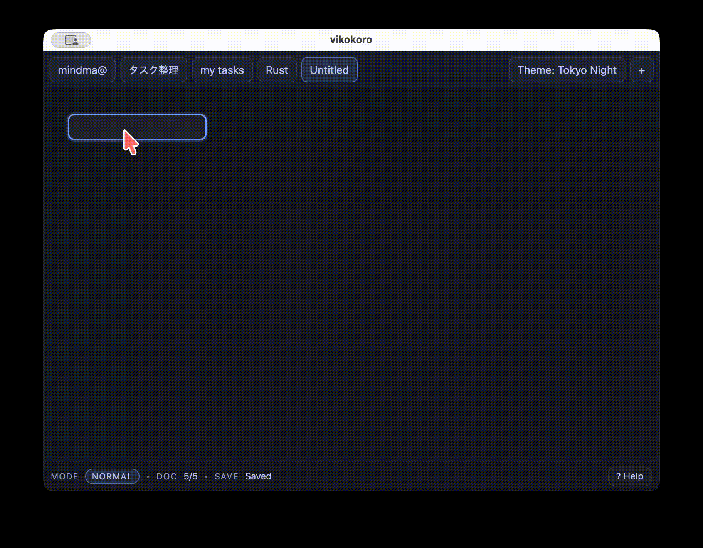

# vikokoro

Tauri v2 + React + TypeScript で作った、キーボード中心のツリー/マインドマップ風エディタです。
Vimライクな **Normal / Insert** モードでノードの追加・移動・編集ができます。



このデモでは、ノード追加（`Tab` / `Enter`）→編集（Insert）→移動（`hjkl` + `j/k`）の基本操作をしています。

※ 現状は個人開発のため、仕様は変わる可能性があります。

---

## できること

- Normal / Insert のモード切り替えで編集
- `Tab` で子ノード追加、`Enter` で兄弟ノード追加（どちらも即編集）
- `hjkl` + `j/k` でカーソル移動、`J/K` で兄弟の並び替え
- `dd` で削除（ルートは保護、子は繰り上げ）
- Undo / Redo
- タブ（複数ドキュメント）
- 検索（`Ctrl+F`） / コマンドパレット（`Ctrl+P`） / ヘルプ（`?`）
- ズーム（`Ctrl + Wheel`） / パン（`Space + Drag`）
- ローカル永続化（Tauri起動時のみ）

---

## 使い方（操作）

ショートカット一覧はアプリ内のヘルプが最新です。

- ヘルプ: `?`
- 閉じる: `Esc`

よく使うキー（Normal）:

- `Tab`: 子を追加して編集
- `Enter`: 兄弟を追加して編集
- `h/j/k/l`: 親/次/前/子へ移動
- `dd`: 削除
- `u` / `Ctrl+r`: Undo / Redo

編集（Insert）:

- `i`: Insertに入る
- `Esc`: 確定してNormalへ
- `Enter`: 確定
  - 日本語IMEで変換を使った入力の場合は、変換確定の都合で「Enterが2段階」になることがあります
    （英数入力では1回で確定する想定です）

---

## データ保存について

Tauri起動時（`npm run tauri dev` / `npm run tauri build` で起動したアプリ）では、ワークスペースをローカルに保存します。

- 保存先: OSごとの AppData 配下の `workspace.json`
  - Tauri側で `BaseDirectory::AppData` を使用
- ブラウザ起動（`npm run dev`）では `invoke` が使えないため、永続化は無効（UIは `Local` 表示）

---

## セットアップ（開発者向け）

### 必要なもの

- Node.js（Vite要件の都合で **20.19+ または 22.12+ 推奨**）
- Rust（stable）

IDEは VS Code + rust-analyzer + Tauri拡張が便利です。

### インストール

```sh
npm ci
```

### 起動

ブラウザで起動（永続化なし）:

```sh
npm run dev
```

Tauriで起動（永続化あり）:

```sh
npm run tauri dev
```

### ビルド

```sh
npm run tauri build
```

生成物は概ね `src-tauri/target/release/bundle/` 配下に出ます。

---

## GitHub Actions（macOS/Windowsビルド）

手元にビルド環境が無い端末向けに、GitHub Actionsで実行ファイルを生成できます。

- Workflow: `.github/workflows/tauri-build.yml`
- 実行方法: GitHub の `Actions` タブ → `tauri-build` → `Run workflow`
- 生成物: Actions の `Artifacts` に `vikokoro-macos-latest` / `vikokoro-windows-latest` が出ます

---

## トラブルシューティング

### macOSで「壊れているため開けません」と出る

未署名アプリをダウンロードした際に、Gatekeeper（quarantine属性）で弾かれることがあります。
自分の端末で動かすだけなら、次で回避できる場合があります。

```sh
xattr -dr com.apple.quarantine "/Applications/vikokoro.app"
```

（必要なら）状況確認:

```sh
spctl --assess --verbose=4 "/Applications/vikokoro.app"
```

### Node.js のバージョン警告が出る

Viteの要件により Node.js のバージョンが古いと警告が出ます。
`node -v` を確認し、必要なら `22.12+` または `20.19+` に上げてください。

---

## 主要ディレクトリ

- `src/`: フロントエンド（React/TS）
- `src/editor/`: エディタ本体（状態管理・レイアウト・ビュー）
- `src/hooks/`: 永続化などのhooks
- `src/ui/modals/`: Help/Search/Paletteなどのモーダル
- `src-tauri/`: Tauri（Rust）側
- `docs/`: マイルストーンや引き継ぎメモ

---

## ライセンス

MIT（`LICENSE`）
